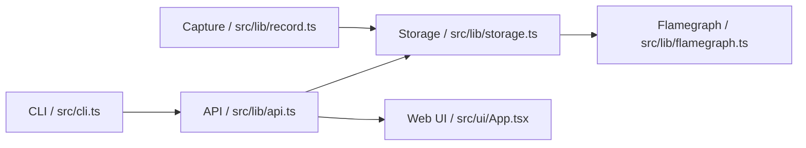

# Linux Continuous CPU Profiler

一个面向 Linux 生产环境的持续 CPU Profiling 工具。它把 CPU 采样、时间索引、火焰图生成和事故回放串成一条链，帮助值班同学在故障恢复后继续追查“当时 CPU 到底花在哪儿了”。

当前仓库已经提供可运行的 mock-first 实现：CLI、API、Web 控制台、测试和本地存储都可直接跑起来；真实 `perf` 采集路径还在逐步接入中。

## 使用说明

### 环境要求

- Node.js 20+
- Linux 环境优先，macOS 可用于开发和 mock 演示
- 本地默认数据目录：`./data`
- 可通过环境变量 `CPU_PROFILER_DATA_DIR` 覆盖数据目录

### 安装

```bash
npm install
```

### 生成演示数据

```bash
npm run seed
```

这会生成一组 mock 采样记录、折叠栈和火焰图，方便直接预览控制台效果。

### 启动开发模式

```bash
npm run dev
```

- Web 控制台默认运行在 `http://localhost:5173`
- API 与前端会同时启动
- 适合本地调试和 UI 迭代

### 构建与启动

```bash
npm run build
npm start
```

- `build` 会产出 `dist-web/` 和 `dist-server/`
- `start` 会启动编译后的服务端

### CLI 用法

```bash
npm run cli -- doctor
npm run cli -- record --service service-a --mock
npm run cli -- list
npm run cli -- serve --port 8787
```

- `doctor`：检查依赖和运行环境
- `record`：当前以 mock 方式生成一条可用采样记录
- `list`：查看已保存的采样记录
- `serve`：启动控制台服务，默认端口 `8787`

### Web 控制台

- 左侧展示健康状态、采样记录列表
- 中间展示时间线和火焰图预览
- 右侧展示采样详情、样本数和 top stacks

### API 速览

- `GET /api/health`
- `GET /api/sessions`
- `GET /api/sessions/query?at=2026-05-09T03:17:42.000Z`
- `GET /api/sessions/:id`
- `GET /api/sessions/:id/flamegraph`

## 设计说明

### 设计目标

- 用持续采样补上“事故恢复后缺失的 CPU 现场证据”
- 优先保证可回放、可查询、可轮转
- 在 `perf` 不可用时，也保留一条可演示、可测试的最小闭环
- 尽量让 CLI、API、前端共用同一套 TypeScript 类型和数据结构

### 总体结构



### 模块分工

- `src/cli.ts`：承载 `doctor`、`record`、`list`、`serve`
- `server/index.ts`：挂载 API 并暴露 Web 控制台
- `src/lib/api.ts`：提供健康检查、会话查询和火焰图接口
- `src/lib/storage.ts`：负责会话索引、读取、裁剪和健康快照
- `src/lib/record.ts`：负责 mock 采样记录的生成与轮转
- `src/lib/flamegraph.ts`：把采样数据渲染成 SVG 火焰图
- `src/ui/App.tsx`：事故控制台主界面

### 数据模型

当前实现采用“会话索引 + 文件落盘”的方式：

- `data/sessions.jsonl`：采样记录索引
- `data/sessions/<id>/folded.txt`：折叠栈
- `data/sessions/<id>/flamegraph.svg`：火焰图
- `data/sessions/<id>/perf.data`：采样原始数据占位

这样做的好处是：

- 查询简单，时间线和会话列表都能直接从索引读取
- 数据文件可以按时间轮转和清理
- 方便后续把 mock 数据替换成真实 `perf` 输出

### 交互逻辑

1. 用户进入控制台后，前端同时拉取 `/api/health` 和 `/api/sessions`
2. 健康接口提供当前采样状态、存储占用和最近一次采样时间
3. 会话列表决定时间线和详情面板默认展示哪一条记录
4. 选择某条记录后，前端拉取对应的 `flamegraph.svg`
5. 右侧面板展示目标、时间窗口、样本数和 top stacks

### 当前边界

- 真实 `perf` 采集路径尚未完全接入
- `record --mock` 是当前最稳妥的可用入口
- 这版更偏“可演示、可验证、可持续演进”，不是最终生产定稿

## 测试

```bash
npm test
npm run build
```

当前测试覆盖：

- session 写入、读取和裁剪
- API 健康检查、会话查询和火焰图输出
- 前端事故控制台首屏渲染

## 相关文档

- [PRD](docs/PRD.md)
- [监控与诊断思路](docs/monitoring-strategy.md)
- [AI Coding Skill 草案](skills/linux-continuous-cpu-profiling/SKILL.md)
- [AI 对话记录导出说明](ai-conversation/EXPORT_INSTRUCTIONS.md)
